# Architecture Design Document

Detailed technical architecture based on the PRD. Defines the design, data flow, API contracts, and security model for each component.

---

## 1. Overall System Architecture

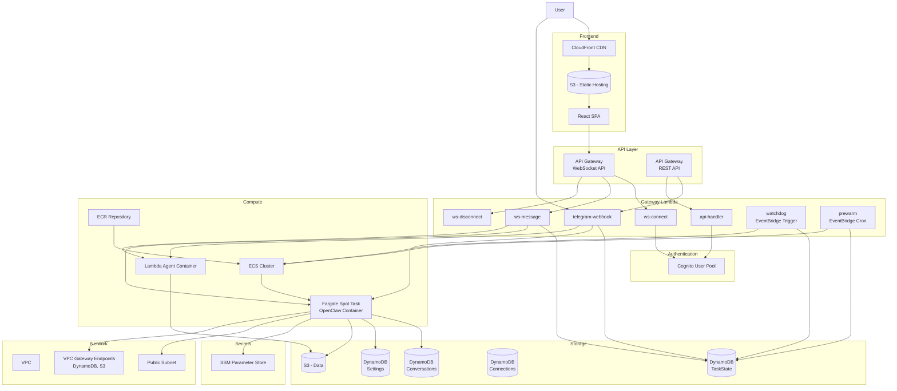

---

## 2. Network Design

### Design Principle: Eliminating NAT Gateway

A NAT Gateway costs at least ~$33/month ($4.5 fixed + data processing costs) even in a single-AZ minimal configuration. This exceeds the overall cost target ($1/month) by more than 30x, so we assign Public IPs to Fargate tasks and completely eliminate the NAT Gateway.

### VPC Configuration

```
VPC: 10.0.0.0/16

Public Subnets (Fargate tasks, Public IP assigned):
  - 10.0.1.0/24 (AZ-a)
  - 10.0.2.0/24 (AZ-b)

Private Subnets: None (NAT Gateway not needed)
```

### Network Flow

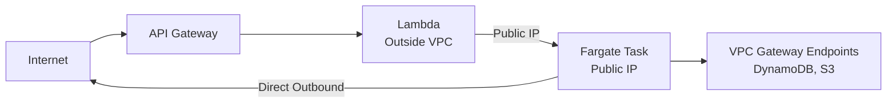

- **Fargate Tasks**: Placed in public subnets with Public IP assigned. Directly access external services such as LLM APIs (no NAT required)
- **Lambda**: Runs outside the VPC. Manages tasks via ECS API, communicates with the Bridge server via HTTP using the Fargate Public IP
- **VPC Gateway Endpoints**: Keeps DynamoDB and S3 traffic within the AWS internal network (free, optimized performance)

### Security Groups

| Security Group | Inbound | Outbound |
|----------|---------|----------|
| **sg-fargate** | 8080 (Bridge) - 0.0.0.0/0 (protected by auth token) | All allowed (443 HTTPS - LLM API, AWS services) |

> **Bridge Security**: Lambda runs outside the VPC and has no fixed IP, so source IP restriction via Security Group is not possible. The Bridge server's shared secret token authentication blocks unauthorized access.

### VPC Gateway Endpoints

Although Fargate can directly access the internet via Public IP, AWS service traffic is routed through VPC Gateway Endpoints over the AWS internal network to reduce latency and save data transfer costs.

| Service | Endpoint Type | Cost | Reason |
|--------|-------------|------|------|
| DynamoDB | Gateway | Free | Frequent conversation history reads/writes |
| S3 | Gateway | Free | File backup/configuration access |

> **Note**: ECR, CloudWatch Logs, SSM Parameter Store, etc. are accessed via Fargate's Public IP through public endpoints. Interface Endpoints (~$7/month each) do not align with the cost target and are therefore not used.

---

## 3. Gateway Lambda Detailed Design

Gateway Lambda is split into 7 independent functions following the single responsibility principle.

### 3.1 Function List

| Function | Trigger | Role | Timeout |
|------|--------|------|---------|
| `ws-connect` | WebSocket $connect | Connection establishment, authentication, connectionId storage | 10s |
| `ws-message` | WebSocket $default | Message reception, container routing | 30s |
| `ws-disconnect` | WebSocket $disconnect | Connection cleanup | 10s |
| `telegram-webhook` | REST POST /telegram | Telegram message reception, routing | 30s |
| `api-handler` | REST GET/POST /api/* | Settings query/update, conversation history | 10s |
| `watchdog` | EventBridge (5-min interval) | Zombie task detection and termination | 60s |
| `prewarm` | EventBridge (cron, optional) | Predictive pre-warming — proactively starts containers before scheduled usage | 30s |

### 3.2 WebSocket Message Processing Flow

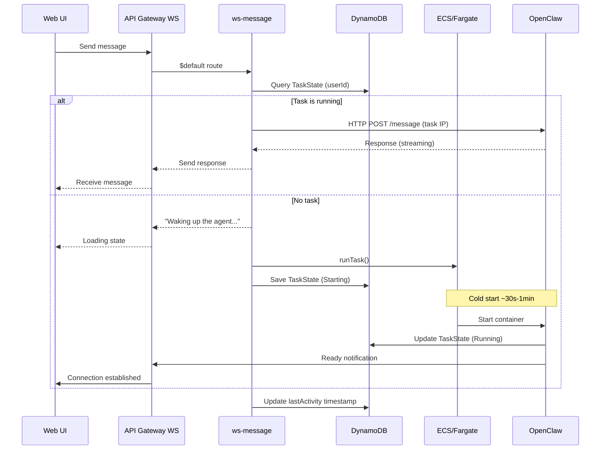

### 3.3 Telegram Message Processing Flow

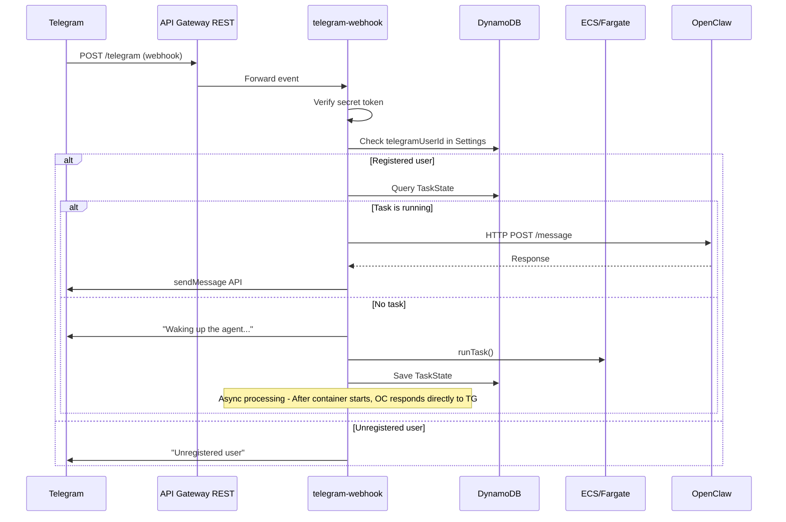

### 3.4 Watchdog (Zombie Task Detection)

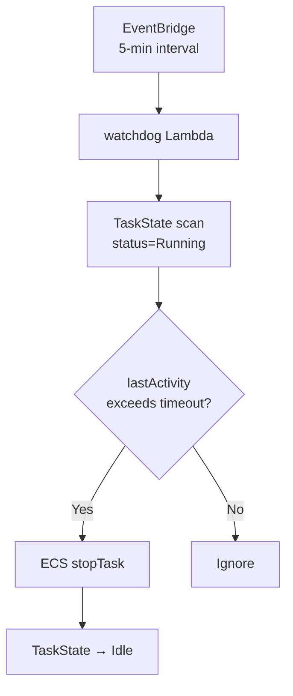

- **Default timeout**: 15 minutes (user-configurable)
- **Scan interval**: 5 minutes (EventBridge rule)
- **Safety guard**: Tasks within 5 minutes of startup are not terminated (cold start protection)

---

## 4. OpenClaw Container Design

### 4.1 Docker Image Configuration

```dockerfile
# Phase 1: Lightweight image
FROM node:20-slim

# Install OpenClaw
RUN npm install -g openclaw@latest

# Copy Bridge server
COPY src/ /app/
WORKDIR /app

# Bridge server port
EXPOSE 8080

# Health check
HEALTHCHECK --interval=30s --timeout=5s \
  CMD curl -f http://localhost:8080/health || exit 1

CMD ["node", "bridge.js"]
```

```dockerfile
# Phase 2: With Chromium
FROM node:20-slim

RUN apt-get update && apt-get install -y \
    chromium \
    --no-install-recommends \
    && rm -rf /var/lib/apt/lists/*

ENV PUPPETEER_EXECUTABLE_PATH=/usr/bin/chromium

# Same as above
```

### 4.2 Bridge Server Architecture

The Bridge server is an intermediary layer between Gateway Lambda and OpenClaw.

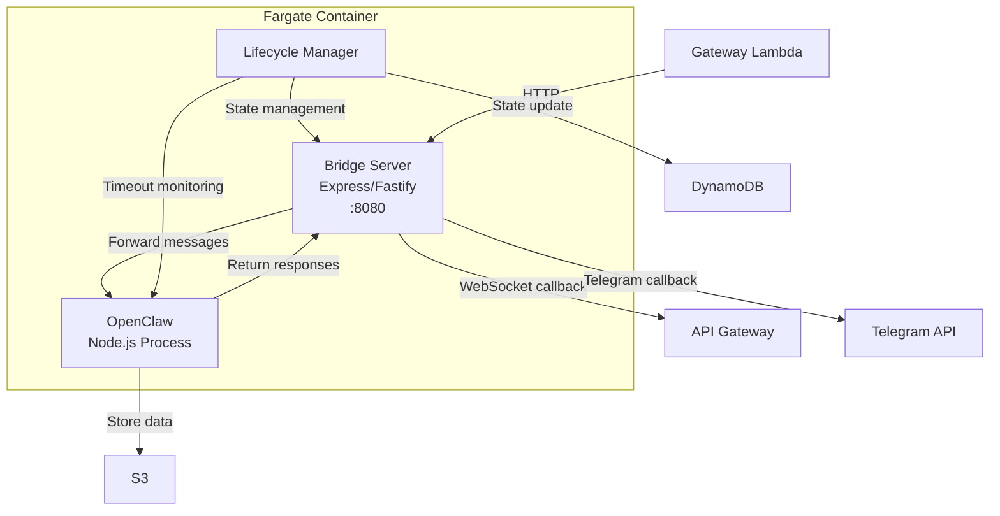

### 4.3 Bridge API Endpoints

| Method | Path | Description |
|--------|------|------|
| POST | `/message` | Forward message. body: `{ userId, message, channel, callbackUrl }` |
| GET | `/health` | Health check. `{ status: "ok", uptime, activeConversations }` |
| POST | `/shutdown` | Graceful shutdown request (for Spot interruption handling) |
| GET | `/status` | Container status information |

### 4.4 Container → Client Response Mechanism

Since OpenClaw responses are asynchronous, the Bridge delivers them to clients via a callback mechanism:

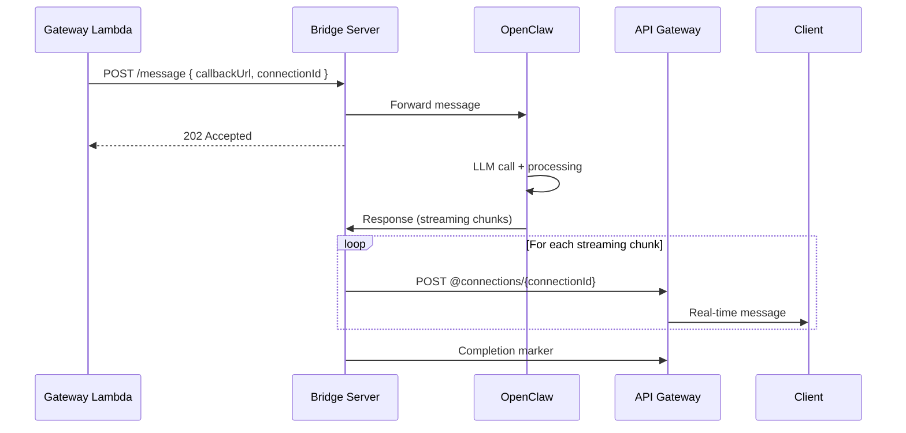

### 4.5 Fargate Task Definition

| Item | Value | Notes |
|------|-----|------|
| CPU | 1 vCPU (1024 units) | Configurable via `FARGATE_CPU` env var |
| Memory | 2 GB (2048 MB) | Configurable via `FARGATE_MEMORY` env var |
| Platform | LINUX/ARM64 | Graviton (higher Spot availability + 20% cheaper) |
| Capacity Provider | FARGATE_SPOT | 70% discount |
| Task Role | openclaw-task-role | DynamoDB, S3, SSM access |
| Execution Role | openclaw-exec-role | ECR pull, CloudWatch logs |
| Log Driver | awslogs | Send to CloudWatch Logs group |
| Assign Public IP | true | Public subnet, direct internet access (no NAT needed) |

### 4.6 Spot Interruption Handling

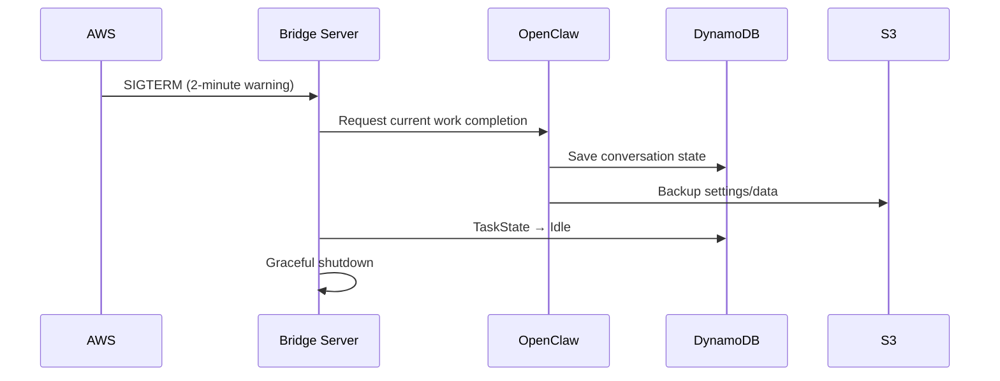

---

## 5. DynamoDB Table Detailed Design

### 5.1 Conversations Table

Stores conversation history. Uses single-table design for efficient per-user conversation queries.

| Attribute | Type | Description |
|------|------|------|
| **PK** | S | `USER#{userId}` |
| **SK** | S | `CONV#{conversationId}#MSG#{timestamp}` |
| role | S | `user` / `assistant` / `system` |
| content | S | Message content |
| channel | S | `web` / `telegram` |
| metadata | M | Token count, LLM model name, etc. |
| ttl | N | TTL timestamp (conversation retention period) |

**Access Patterns:**

| Pattern | Query |
|------|------|
| User's conversation list | PK = `USER#{userId}`, SK begins_with `CONV#` |
| Messages for a specific conversation | PK = `USER#{userId}`, SK begins_with `CONV#{convId}#MSG#` |
| Most recent N messages | Above query + ScanIndexForward=false, Limit=N |

### 5.2 Settings Table

User settings and system configuration.

| Attribute | Type | Description |
|------|------|------|
| **PK** | S | `USER#{userId}` |
| **SK** | S | `SETTING#{key}` |
| value | S / M | Setting value |
| updatedAt | S | ISO 8601 timestamp |

**Key Setting Keys:**

| SK | Example Value | Description |
|----|--------|------|
| `SETTING#llm_provider` | `{ provider: "anthropic", model: "claude-sonnet-4-5-20250929" }` | LLM provider |
| `SETTING#timeout` | `{ minutes: 15 }` | Inactivity timeout |
| `SETTING#skills` | `{ enabled: ["browser", "calendar"] }` | Enabled skills |

**Identity Linking Keys (OTP + bidirectional link):**

| PK | SK | Value | TTL | Description |
|----|----|----|-----|------|
| `USER#{cognitoId}` | `SETTING#telegram-otp` | `{ code: "123456" }` | 5 min | OTP code (generated by Web) |
| `USER#otp:123456` | `SETTING#otp-owner` | `{ cognitoUserId: "abc" }` | 5 min | OTP reverse lookup (used when Telegram `/link` is called) |
| `USER#{cognitoId}` | `SETTING#linked-telegram` | `{ telegramUserId: "67890" }` | — | Forward link (Cognito → Telegram) |
| `USER#telegram:67890` | `SETTING#linked-cognito` | `{ cognitoUserId: "abc" }` | — | Reverse link (Telegram → Cognito) |

### 5.3 TaskState Table

Tracks Fargate task state.

| Attribute | Type | Description |
|------|------|------|
| **PK** | S | `USER#{userId}` |
| taskArn | S | ECS task ARN |
| status | S | `Idle` / `Starting` / `Running` / `Stopping` |
| publicIp | S | Task public IP (when Running) |
| startedAt | S | Start time |
| lastActivity | S | Last activity time |
| ttl | N | TTL for automatic deletion |

### 5.4 Connections Table

WebSocket connection management.

| Attribute | Type | Description |
|------|------|------|
| **PK** | S | `CONN#{connectionId}` |
| userId | S | Connected user ID |
| connectedAt | S | Connection time |
| ttl | N | Automatic deletion after 24 hours |

**GSI (userId-index):**

| GSI PK | GSI SK |
|--------|--------|
| userId | connectedAt |

> Used to query a user's active WebSocket connections for broadcasting messages.

### 5.5 PendingMessages Table

Message queue to prevent loss during cold start. Temporarily stores messages that arrive before the container starts, and the Bridge consumes them after startup.

| Attribute | Type | Description |
|------|------|------|
| **PK** | S | `USER#{userId}` |
| **SK** | S | `MSG#{timestamp}#{uuid}` |
| message | S | User message content |
| channel | S | `web` / `telegram` |
| connectionId | S | WebSocket connectionId for sending responses |
| createdAt | S | ISO 8601 timestamp |
| ttl | N | Automatic deletion after 5 minutes (cleanup of unprocessed messages) |

**Processing Flow:**
1. Lambda: When the container is not running → Save message to PendingMessages + RunTask
2. Bridge startup: Query PendingMessages for the userId from DynamoDB (SK begins_with `MSG#`)
3. Bridge: Forward each pending message to OpenClaw Gateway in order
4. Bridge: Delete processed messages (`DeleteItem`)

> **TTL Safety Guard**: The 5-minute TTL ensures that pending messages do not accumulate indefinitely even if the Bridge terminates abnormally.

---

## 6. API Gateway Design

### 6.1 WebSocket API

| Route | Lambda | Auth | Description |
|-------|--------|------|------|
| `$connect` | ws-connect | Cognito JWT (query string) | Connection establishment |
| `$default` | ws-message | Identified by connectionId | Message processing |
| `$disconnect` | ws-disconnect | Identified by connectionId | Connection termination |

**Authentication on Connection:**

```
wss://xxx.execute-api.region.amazonaws.com/prod?token={jwt_token}
```

The ws-connect Lambda validates the JWT and stores the connectionId and userId in the Connections table.

**Message Protocol:**

```typescript
// Client → Server
interface ClientMessage {
  action: "sendMessage" | "getHistory" | "getStatus";
  conversationId?: string;
  message?: string;
}

// Server → Client
interface ServerMessage {
  type: "message" | "status" | "error" | "stream_chunk" | "stream_end";
  conversationId?: string;
  content?: string;
  status?: "starting" | "running" | "stopping" | "idle";
  error?: string;
}
```

### 6.2 REST API

| Method | Path | Lambda | Auth | Description |
|--------|------|--------|------|------|
| POST | `/telegram` | telegram-webhook | Telegram secret | Telegram webhook |
| GET | `/conversations` | api-handler | Cognito JWT | Conversation list |
| GET | `/status` | api-handler | Cognito JWT | Container status |
| POST | `/link/generate-otp` | api-handler | Cognito JWT | Generate 6-digit OTP for Telegram linking |
| GET | `/link/status` | api-handler | Cognito JWT | Query current linking status |
| POST | `/link/unlink` | api-handler | Cognito JWT | Unlink Telegram account |

**CORS Configuration:** `corsPreflight` applied to HTTP API (`allowOrigins: ["*"]`, `allowHeaders: [Authorization, Content-Type]`). Allows cross-origin calls from Web (CloudFront) → API Gateway.

### 6.3 Cognito Authorizer

A Cognito User Pool Authorizer is attached to the REST API for automatic JWT validation:

```typescript
// CDK definition example
const authorizer = new apigateway.CognitoUserPoolsAuthorizer(this, "Authorizer", {
  cognitoUserPools: [userPool],
});

api.addMethod("GET", integration, {
  authorizer,
  authorizationType: apigateway.AuthorizationType.COGNITO,
});
```

---

## 7. Authentication and Security Design

### 7.1 Cognito User Pool Configuration

| Item | Setting |
|------|------|
| Sign-in attribute | Email |
| MFA | Optional (TOTP) |
| Password policy | Minimum 8 characters, upper/lower/numbers/special characters |
| Self-service sign-up | Enabled (email verification required) |
| Token expiration | Access: 1 hour, Refresh: 30 days |

### 7.2 Telegram Authentication Flow

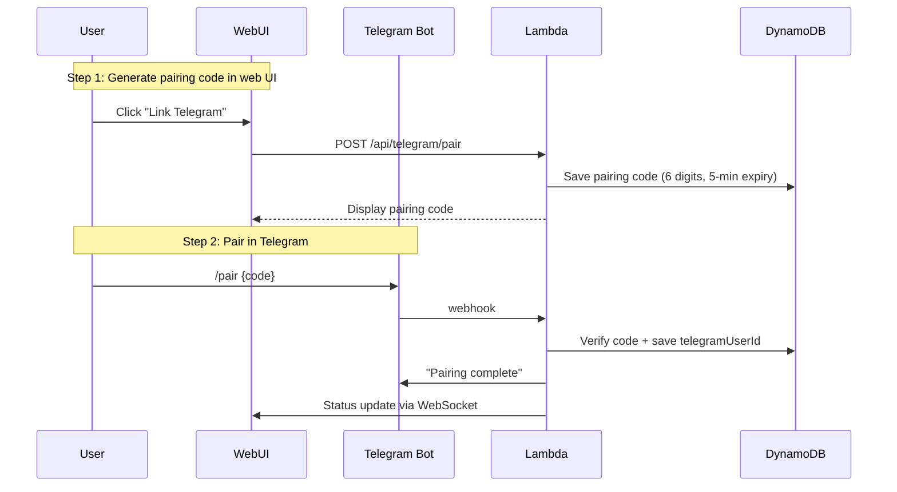

### 7.3 Secrets Management

| Secret | Storage | Accessed By |
|--------|-------|----------|
| Telegram Bot Token | SSM Parameter Store (SecureString) | Lambda (telegram-webhook) |
| LLM API Keys (Claude, GPT, etc.) | SSM Parameter Store (SecureString) | Fargate (OpenClaw) |
| Cognito Client Secret | SSM Parameter Store | Lambda (api-handler) |
| WebSocket Callback URL | SSM Parameter Store | Fargate (Bridge) |
| Database settings | Environment variables (CDK-injected) | Lambda, Fargate |

### 7.4 IAM Roles

**Lambda execution role (`gateway-lambda-role`):**

```json
{
  "Statement": [
    {
      "Effect": "Allow",
      "Action": ["dynamodb:GetItem", "dynamodb:PutItem", "dynamodb:Query", "dynamodb:DeleteItem"],
      "Resource": "arn:aws:dynamodb:*:*:table/serverless-openclaw-*"
    },
    {
      "Effect": "Allow",
      "Action": ["ecs:RunTask", "ecs:StopTask", "ecs:DescribeTasks"],
      "Resource": "*",
      "Condition": { "StringEquals": { "ecs:cluster": "{cluster-arn}" } }
    },
    {
      "Effect": "Allow",
      "Action": ["iam:PassRole"],
      "Resource": ["arn:aws:iam::*:role/openclaw-task-role", "arn:aws:iam::*:role/openclaw-exec-role"]
    },
    {
      "Effect": "Allow",
      "Action": ["execute-api:ManageConnections"],
      "Resource": "arn:aws:execute-api:*:*:*/prod/POST/@connections/*"
    },
    {
      "Effect": "Allow",
      "Action": ["secretsmanager:GetSecretValue"],
      "Resource": "arn:aws:secretsmanager:*:*:secret:serverless-openclaw/*"
    }
  ]
}
```

**Fargate task role (`openclaw-task-role`):**

```json
{
  "Statement": [
    {
      "Effect": "Allow",
      "Action": ["dynamodb:GetItem", "dynamodb:PutItem", "dynamodb:Query", "dynamodb:UpdateItem"],
      "Resource": "arn:aws:dynamodb:*:*:table/serverless-openclaw-*"
    },
    {
      "Effect": "Allow",
      "Action": ["s3:GetObject", "s3:PutObject", "s3:ListBucket"],
      "Resource": ["arn:aws:s3:::serverless-openclaw-data", "arn:aws:s3:::serverless-openclaw-data/*"]
    },
    {
      "Effect": "Allow",
      "Action": ["secretsmanager:GetSecretValue"],
      "Resource": "arn:aws:secretsmanager:*:*:secret:serverless-openclaw/llm-*"
    },
    {
      "Effect": "Allow",
      "Action": ["ssm:GetParameter"],
      "Resource": "arn:aws:ssm:*:*:parameter/serverless-openclaw/*"
    },
    {
      "Effect": "Allow",
      "Action": ["execute-api:ManageConnections"],
      "Resource": "arn:aws:execute-api:*:*:*/prod/POST/@connections/*"
    }
  ]
}
```

### 7.5 Public IP Multi-Layer Defense Strategy

Since Public IPs are assigned to Fargate to eliminate the NAT Gateway, the Bridge server (`:8080`) is exposed to the internet. Security is ensured through the following layered defenses.

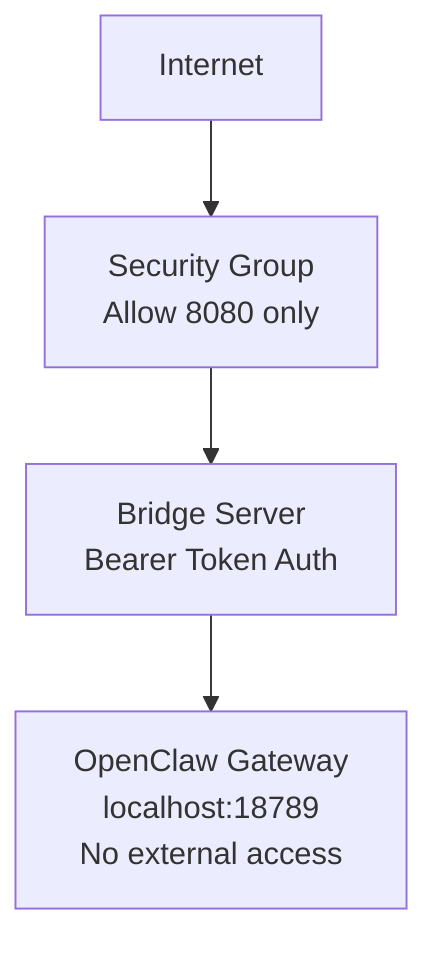

| Layer | Measure | Defends Against | Cost |
|------|------|----------|------|
| Security Group | Allow inbound 8080 only, block all others | Port scanning, unnecessary service exposure | $0 |
| Bridge Auth | `Authorization: Bearer <token>` validation. Required for all endpoints except `/health` | Unauthorized API calls | $0 |
| Gateway localhost binding | `--bind localhost` — port 18789 only accessible within the container | Direct Gateway access blocked | $0 |
| Token management | Stored in SSM Parameter Store (SecureString), injected via environment variables. Never written to disk | Token leakage | $0 |
| Non-root container | `USER openclaw` — runs as unprivileged user | Privilege escalation on container escape | $0 |
| TLS | Self-signed certificate on Bridge (Node.js `https.createServer`) | Token sniffing (plaintext HTTP segment) | $0 |

> **Cost Impact**: The entire multi-layer defense adds no cost. SSM Parameter Store standard parameters are free.

### 7.6 Bridge Authentication Details

```
Lambda → Bridge request:
  POST https://{publicIp}:8080/message
  Headers:
    Authorization: Bearer {BRIDGE_AUTH_TOKEN}
    Content-Type: application/json
  Body: { userId, message, channel, connectionId, callbackUrl }

Bridge validation:
  1. Extract Bearer token from Authorization header
  2. Verify match against BRIDGE_AUTH_TOKEN environment variable
  3. Return 401 Unauthorized immediately on mismatch
  4. Only /health endpoint is exempt from auth (for ECS health checks)
```

**Token Lifecycle:**
- Manually created in SSM Parameter Store as SecureString (32-byte random via `openssl rand -hex 32`)
- Same token injected into both Lambda environment variables and Fargate container environment variables
- Token rotation: Update SSM parameter + redeploy + container restart to apply

### 7.7 Container Security Hardening

| Item | Setting | Reason |
|------|------|------|
| Execution user | `openclaw` (non-root) | OpenClaw skills can execute arbitrary code, so root privileges are restricted |
| Read-only root filesystem | `readonlyRootFilesystem: true` (Phase 2) | Prevent container tampering |
| Gateway binding | `--bind localhost` | Block external exposure of port 18789 |
| EXPOSE | 8080 only | 18789 is localhost-only, no exposure needed |
| Secret delivery | Environment variables (SSM Parameter Store → ECS) | No API keys written to disk. Tokens not included in `openclaw.json` |
| Home directory | `/home/openclaw/` | Uses non-root user home instead of `/root/` |

### 7.8 IDOR (Insecure Direct Object Reference) Prevention

All API paths enforce that authenticated users can only access their own resources.

| Layer | Validation Logic |
|------|----------|
| **ws-message Lambda** | connectionId → Look up userId from Connections table → Verify match with request userId |
| **Bridge /message** | Only uses the userId passed by Lambda. Client-provided userId is ignored |
| **REST API (conversation history)** | DynamoDB queries use only the userId extracted from JWT (PK = `USER#{jwt.sub}`) |
| **Telegram webhook** | Look up paired telegramUserId → userId mapping table. Reject unpaired users |

> **Principle**: userId is always determined server-side (via JWT or connectionId reverse lookup). Never trust userId sent by the client.

### 7.9 Telegram-Web Identity Linking

OTP-based account linking that allows the same user to share a single container when using both Web (Cognito UUID) and Telegram (`telegram:{fromId}`).

**Linking flow:**

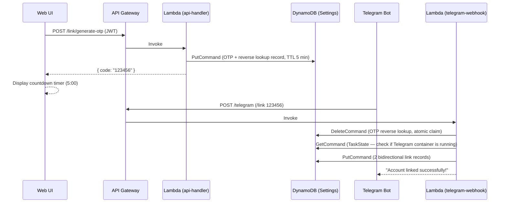

**Message routing (after linking):**

1. Telegram message arrives → `telegram-webhook` Lambda
2. `resolveUserId(dynamoSend, "telegram:67890")` → look up `linked-cognito` in Settings table
3. Link exists → return Cognito UUID → call `routeMessage()` with this userId
4. Route to container at TaskState(`USER#{cognitoId}`) → shares same container as Web

**Security:**

| Threat | Defense |
|--------|---------|
| OTP brute force | 6 digits × 5-min TTL × API Gateway throttling |
| Unauthorized OTP generation | Cognito JWT authentication required |
| Telegram impersonation | Telegram API verifies `from.id` (webhook secret token) |
| IDOR (unlinking another user) | Unlinking only possible from Web (Cognito JWT); Telegram `/unlink` not allowed |
| Container conflict during linking | Linking rejected if Telegram container is already running |

### 7.10 Secrets Never Written to Disk Principle

Ensures that API keys, tokens, and other secrets are never written to the container filesystem.

| Secret | Delivery Method | Written to Disk |
|--------|----------|----------------|
| ANTHROPIC_API_KEY | SSM Parameter Store → ECS environment variable | **Never** — not included in `openclaw.json` |
| BRIDGE_AUTH_TOKEN | SSM Parameter Store → ECS/Lambda environment variable | **Never** |
| OPENCLAW_GATEWAY_TOKEN | SSM Parameter Store → ECS environment variable | **Never** — uses environment variable instead of CLI `--token` argument |
| TELEGRAM_BOT_TOKEN | SSM Parameter Store → Lambda environment variable | **Never** — not passed to container (webhook-only approach) |

**Caution When Patching Config:**

```typescript
// patch-config.ts — Do not write secrets to config files
// API keys are delivered only via environment variables; config contains only provider/model settings
config.auth = { method: "env" }; // Reference environment variable instead of "apiKey"
delete config.auth?.apiKey;       // Remove if it exists
```

> **Difference from MoltWorker**: MoltWorker writes API keys directly to `openclaw.json` and backs them up to R2. We deliver them only via environment variables through SSM Parameter Store, ensuring secrets are not included in S3 backups.

---

## 8. CDK Stack Design

Each stack is independently deployable, with dependency relationships managed by CDK.

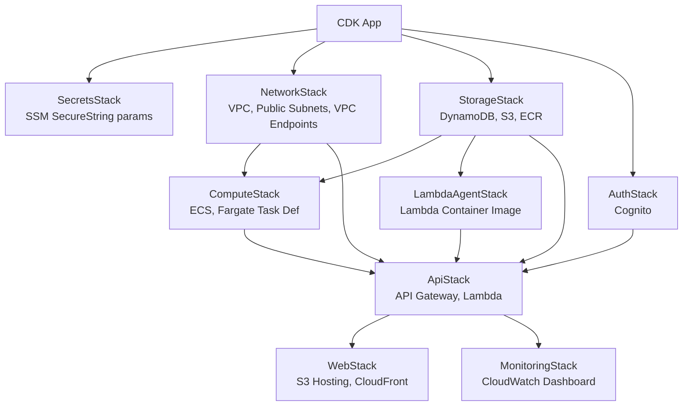

### Resources per Stack

| Stack | Resources | Dependencies |
|------|--------|--------|
| **SecretsStack** | SSM SecureString parameters (5 secrets) | None |
| **NetworkStack** | VPC, Public Subnets, VPC Gateway Endpoints (DynamoDB, S3) | None |
| **StorageStack** | 5 DynamoDB tables, 2 S3 buckets, ECR repository | None |
| **AuthStack** | Cognito User Pool, App Client | None |
| **ComputeStack** | ECS Cluster, Fargate task definition, IAM roles | Network, Storage |
| **LambdaAgentStack** | Lambda Container Image (DockerImageFunction), ECR, IAM roles | Storage |
| **ApiStack** | API Gateway (WS+REST), 7 Lambda functions, IAM roles, EventBridge rules | Network, Storage, Auth, Compute |
| **WebStack** | S3 bucket (web), CloudFront distribution | Api (WebSocket URL injection) |
| **MonitoringStack** | CloudWatch Dashboard (6 rows, 10 custom metrics) | Api |

### Environment Variables and Configuration Injection

Settings injected from CDK into Lambda/Fargate:

```typescript
// Lambda environment variables
{
  DYNAMODB_TABLE_PREFIX: "serverless-openclaw",
  ECS_CLUSTER_ARN: cluster.clusterArn,
  TASK_DEFINITION_ARN: taskDef.taskDefinitionArn,
  SUBNET_IDS: privateSubnets.join(","),
  SECURITY_GROUP_ID: fargateSecurityGroup.securityGroupId,
  WEBSOCKET_API_ENDPOINT: wsApi.apiEndpoint,
  TELEGRAM_SECRET_ARN: telegramSecret.secretArn,
}

// Fargate environment variables
{
  DYNAMODB_TABLE_PREFIX: "serverless-openclaw",
  S3_DATA_BUCKET: dataBucket.bucketName,
  WEBSOCKET_CALLBACK_URL: wsApi.apiEndpoint,
  LLM_SECRET_ARN: llmSecret.secretArn,
  INACTIVITY_TIMEOUT_MINUTES: "15",
}
```

---

## 9. Frontend Design

### 9.1 React SPA Structure

```
packages/web/src/
├── components/
│   ├── Chat/
│   │   ├── ChatContainer.tsx    # Main chat container
│   │   ├── MessageList.tsx      # Message list (virtual scrolling)
│   │   ├── MessageBubble.tsx    # Individual message bubble
│   │   ├── MessageInput.tsx     # Input form
│   │   └── StreamingMessage.tsx # LLM streaming response display
│   ├── Auth/
│   │   ├── LoginForm.tsx        # Login form
│   │   └── AuthProvider.tsx     # Cognito auth context
│   ├── Status/
│   │   ├── AgentStatus.tsx      # Agent status display
│   │   └── ColdStartBanner.tsx  # "Waking up..." banner
│   └── Settings/
│       ├── SettingsPanel.tsx     # Settings panel
│       ├── LLMSelector.tsx      # LLM provider selector
│       └── TelegramPair.tsx     # Telegram pairing UI
├── hooks/
│   ├── useWebSocket.ts          # WebSocket connection management
│   ├── useAuth.ts               # Cognito auth hook
│   └── useAgentStatus.ts        # Agent status hook
├── services/
│   ├── websocket.ts             # WebSocket client
│   ├── api.ts                   # REST API client
│   └── auth.ts                  # Cognito Auth wrapper
├── types/
│   └── index.ts                 # Shared types
├── App.tsx
└── main.tsx
```

### 9.2 WebSocket Connection Management

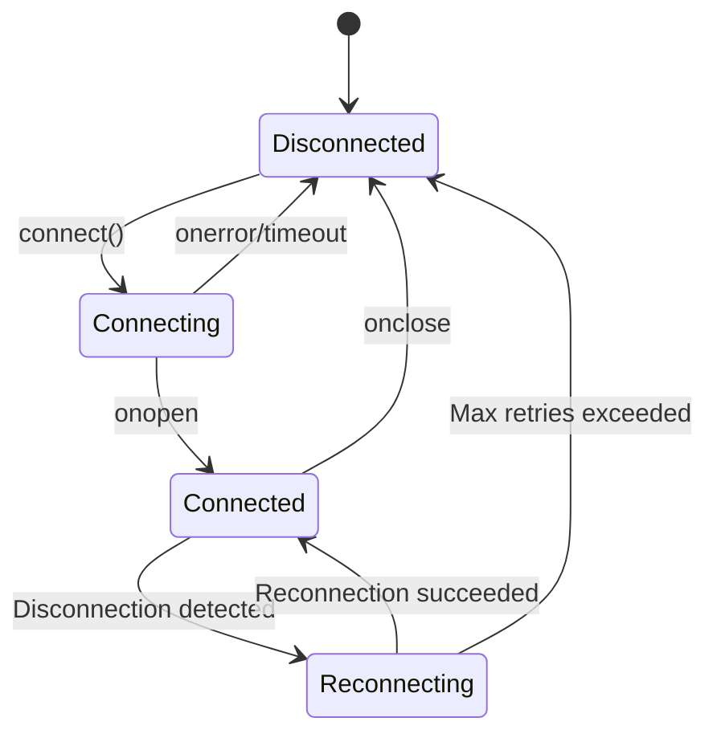

- **Auto-reconnect**: Exponential backoff (1s, 2s, 4s... max 30s)
- **Heartbeat**: Ping every 30 seconds to maintain connection
- **Token refresh**: Automatically refresh with Refresh Token on Access Token expiry, then reconnect

### 9.3 Deployment Settings

| Item | Value |
|------|-----|
| S3 bucket | `serverless-openclaw-web-{accountId}` |
| CloudFront | OAI for S3 access, HTTPS only |
| Cache policy | index.html: no-cache, assets: 1-year cache (hash-based) |
| SPA routing | CloudFront 404 → index.html redirect |
| Environment variables | Injected at build time: `VITE_WS_URL`, `VITE_API_URL`, `VITE_COGNITO_*` |

---

## 10. Deployment Pipeline

### 10.1 Initial Deployment (User)

```bash
# 1. Prerequisites
npm install -g aws-cdk
aws configure  # Set up AWS credentials

# 2. Clone repository and install dependencies
git clone https://github.com/serithemage/serverless-openclaw.git
cd serverless-openclaw
npm install

# 3. Environment setup
cp .env.example .env
# Edit .env: Enter Telegram Bot Token, LLM API Key, etc.

# 4. CDK bootstrap (one-time only)
cdk bootstrap

# 5. Build Docker image + deploy everything
cdk deploy --all

# 6. Check deployment outputs
# - Web UI URL (CloudFront)
# - WebSocket URL
# - REST API URL
```

### 10.2 Updates

```bash
git pull
npm install
cdk deploy --all
```

---

## 11. Monitoring

### CloudWatch Metrics

| Metric | Source | Purpose |
|--------|------|------|
| Lambda execution time/errors | Lambda automatic | Gateway performance |
| Fargate CPU/memory | ECS automatic | Container resources |
| DynamoDB reads/writes | DynamoDB automatic | Data access patterns |
| WebSocket connection count | Custom metric | Concurrent connections |
| Container start/stop count | Custom metric | Usage pattern analysis |
| Cold start duration | Custom metric | UX metric |

### Log Groups

| Log Group | Retention | Source |
|----------|----------|------|
| `/serverless-openclaw/lambda/ws-connect` | 7 days | Lambda |
| `/serverless-openclaw/lambda/ws-message` | 7 days | Lambda |
| `/serverless-openclaw/lambda/telegram` | 7 days | Lambda |
| `/serverless-openclaw/lambda/api` | 7 days | Lambda |
| `/serverless-openclaw/lambda/watchdog` | 7 days | Lambda |
| `/serverless-openclaw/lambda/prewarm` | 7 days | Lambda |
| `/serverless-openclaw/fargate/openclaw` | 14 days | Fargate |

---

## 12. Lambda Agent Architecture (Phase 2)

When `AGENT_RUNTIME=lambda`, the system runs OpenClaw's agent directly in a Lambda Container Image instead of Fargate.

### Data Flow

```
Client → API Gateway (WS/HTTP) → Lambda → Lambda Agent Container → Anthropic API
                                              ↕ (S3 session sync)
                                              S3
```

### Key Differences from Fargate

| Aspect | Fargate | Lambda |
|--------|---------|--------|
| Fixed cost | ~$15/month (idle) | $0 |
| Per-request cost | Included | ~$0.002/min |
| Cold start | ~40-60s | ~10-30s |
| Session storage | Local filesystem + S3 backup | S3 (synced to /tmp) |
| Max execution | Unlimited | 15 minutes |
| Tool execution | Full (bash, file ops) | Limited (/tmp workspace) |

### Feature Flag

`AGENT_RUNTIME` environment variable controls which runtime is deployed:

| Value | ComputeStack | LambdaAgentStack | Default |
|-------|-------------|-------------------|---------|
| `fargate` | Yes | No | Yes (backward compatible) |
| `lambda` | No | Yes | |
| `both` | Yes | Yes | |

### Smart Routing (AGENT_RUNTIME=both)

When `AGENT_RUNTIME=both`, `routeMessage` uses `classifyRoute()` to dynamically choose the optimal runtime:

| Priority | Condition | Route | Reason |
|----------|-----------|-------|--------|
| 1 | Fargate container Running | Fargate | Reuse (already paid for) |
| 2 | Message starts with `/heavy` or `/fargate` | Fargate | User explicit request |
| 3 | Default | Lambda | Fast (1.35s), cheap ($0) |
| 4 | Lambda fails | Fargate (fallback) | Auto-retry with full runtime |

---

## 13. Operational Assistant Runtime (v1.0)

The current production operating model is a hybrid assistant runtime:

- Lambda remains the fast default path for normal chat.
- AgentCore Runtime is the primary control-plane for tool-enabled requests.
- Fargate remains the managed fallback worker when AgentCore is unavailable, times out, or returns a runtime error.
- Gateway stays thin. It makes only a coarse `chat-only` versus `tool-enabled` decision and does not store semantic task state such as source choice, intent kind, or canonical goal.
- `AssistantRuntimeContext` is attached to every Lambda, AgentCore, Fargate, and pending-message request so each runtime knows the same assistant self-state and available capabilities.

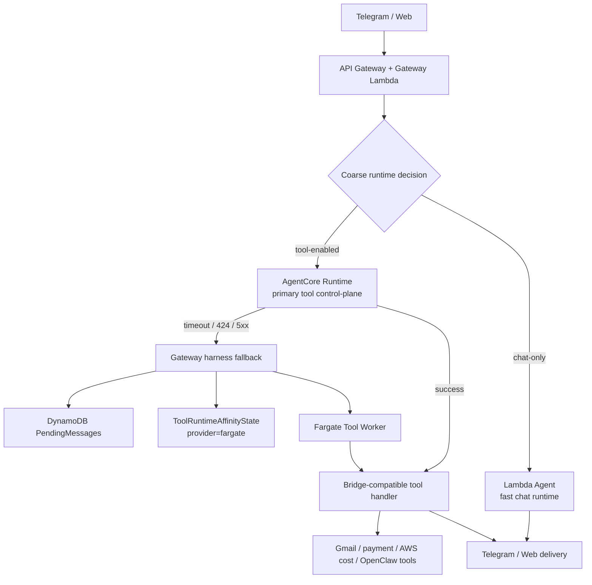

### Runtime responsibilities

| Component | Responsibility | Explicitly not responsible for |
|-----------|----------------|--------------------------------|
| Gateway Lambda | Coarse routing, delivery metadata, runtime harness, affinity TTL, AgentCore fallback lock, `AssistantRuntimeContext` snapshot | Gmail source selection, payment intent interpretation, canonical goal tracking |
| Lambda Agent | Fast general chat, recent `/cost` query-cost recall, image follow-up handling, controlled tool-capability self-awareness | Direct Gmail/payment execution |
| AgentCore Runtime | Primary tool runtime control-plane for Gmail/payment/AWS-cost/tool requests | Permanent memory ownership in v1 |
| Fargate Tool Worker | Durable fallback for AgentCore failures and long tool sessions | Default chat handling |
| Bridge-compatible handler | Tool task context, Gmail/payment follow-ups, topic filtering, AWS Cost Explorer lookup, response delivery | Gateway-level routing decisions |

### AssistantRuntimeContext

`AssistantRuntimeContext` is a transient per-request snapshot generated by Gateway. It is propagated to Lambda, AgentCore, Fargate, and `PendingMessages` so all runtimes share the same self-state.

Key fields:

| Field group | Purpose |
|-------------|---------|
| Identity | `userId`, `channel`, `sessionId`, `traceId`, `generatedAt` |
| Runtime policy | `AGENT_RUNTIME`, `runtimeClass`, `routeDecision`, `toolRuntimeProvider`, `fallbackProvider`, provider lock state |
| Capabilities | Gmail/payment/search/body-selection availability, AWS cost lookup availability, runtime execution location |
| Safety policy | Gmail headers-first budget, payment scan limit, explicit body access requirement |
| Self-awareness guidance | Tells Lambda that Gmail/payment may be available via the tool runtime even when Lambda cannot execute the tool directly |

This avoids the previous failure mode where Lambda and the tool runtime answered as if they had different knowledge of the assistant's capabilities.

### Tool affinity and topic switch policy

Gateway keeps only minimal tool-runtime affinity:

| State | Behavior |
|-------|----------|
| No active affinity | Classify the message as `chat-only` or `tool-enabled` |
| Active tool affinity + contextual follow-up | Keep the turn in the current tool runtime |
| Active tool affinity + explicit cancel | Clear affinity and stop the tool context |
| Active tool affinity + obvious general-chat handoff | Clear affinity and route back to Lambda |
| AgentCore failure | Lock the current affinity to Fargate fallback until expiry or explicit handoff |

Examples of obvious handoff phrases:

- `그거 말고 일반 질문으로 ...`
- `다른 질문인데 ...`
- `이건 일반 답변으로 ...`
- `저녁 메뉴 추천해줘`
- `리눅스에서 파일 찾는 명령어 알려줘`

### Tool task behavior

The tool runtime owns semantic interpretation after a request reaches `tool-enabled`.

| Task family | Runtime behavior |
|-------------|------------------|
| `gmail_payment_summary` | Headers/snippet-first Gmail search, structured payment records, follow-up reuse, user-requested scan expansion |
| Travel/topic payment filtering | Topic facets such as Japan/travel/eSIM/hotel are kept in task context and can trigger limited body confirmation |
| Payment coverage correction | Follow-ups such as `더 있을텐데` and `5개 밖에 없어?` rerun or expand the current task rather than falling through to generic OpenClaw |
| Issuer breakdown | Follow-ups such as `카드사별로` use parsed records first |
| AWS cost lookup | Uses Cost Explorer when explicitly asking for AWS account cost, with a controlled response boundary |

### Cost guardrails

The v1.0 architecture keeps the original cost constraints:

- No NAT Gateway
- No ALB
- No Interface Endpoints
- DynamoDB on-demand tables
- Lambda for default chat
- AgentCore active-consumption only for tool-enabled requests
- Fargate only for fallback or long tool work

### Final regression gate

The v1.0 release gate is:

```powershell
powershell -File .\scripts\final-regression-smoke.ps1 `
  -ChatId <TELEGRAM_CHAT_ID> `
  -TelegramId <TELEGRAM_USER_ID> `
  -Suite Full `
  -BridgeSignalTimeoutSeconds 240
```

The `Full` suite verifies:

- Lambda chat-only routing
- Recent `/cost` query-cost recall
- AWS Cost Explorer lookup
- Gmail/payment capability awareness
- Gmail/payment follow-up continuity
- Travel payment filtering
- Issuer breakdown
- Payment coverage correction
- User-requested payment scan expansion
- Date-range follow-up interpretation
- General chat handoff after tool work
