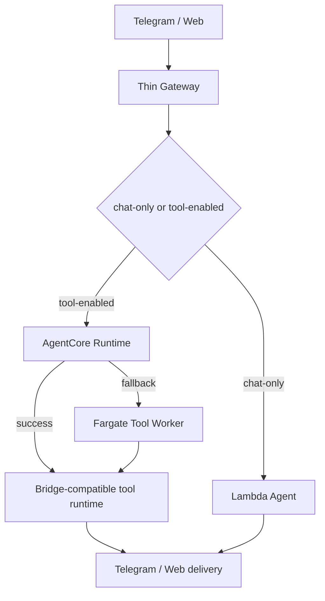

# Operational Copilot v1

Operational Copilot v1 is a read-only diagnostic workflow for Serverless OpenClaw. Its goal is to answer the first operations question quickly:

> Why did the last assistant turn not behave as expected?

The first version is intentionally small. It does not mutate DynamoDB state, stop ECS tasks, redrive queues, or change runtime provider flags. It only gathers evidence and explains the most likely failing layer.

## Scope

The v1 script inspects:

- Gateway Lambda logs
- AgentCore Runtime logs
- Fargate bridge logs
- Lambda agent logs
- `TaskState`
- active tool affinity in `Settings`
- pending messages in `PendingMessages`

It is designed for the current Deep Insight-inspired architecture:



## Usage

Diagnose the latest Telegram-linked user activity:

```powershell
powershell -File .\scripts\diagnose-operational-copilot.ps1 `
  -TelegramId 8585874705 `
  -SinceMinutes 30
```

By default, when a user or Telegram id is provided without an explicit trace id, the script focuses the output on the latest correlated trace. Use `-AllEvents` to inspect the full time window.

Diagnose a specific trace:

```powershell
powershell -File .\scripts\diagnose-operational-copilot.ps1 `
  -TraceId 68457971-d52b-43a3-8f34-bf344941ea16 `
  -SinceMinutes 30
```

Show raw matched events when the summary is not enough:

```powershell
powershell -File .\scripts\diagnose-operational-copilot.ps1 `
  -TelegramId 8585874705 `
  -SinceMinutes 30 `
  -IncludeRawEvents
```

Show the full operational timeline instead of the latest trace only:

```powershell
powershell -File .\scripts\diagnose-operational-copilot.ps1 `
  -TelegramId 8585874705 `
  -SinceMinutes 30 `
  -AllEvents
```

## Diagnosis model

The script maps log evidence to one of these layers:

| Layer | Meaning |
| --- | --- |
| `ingress` | No Gateway, Lambda, or runtime event was found in the selected window. |
| `agentcore` | Gateway invoked AgentCore, but no completion, fallback, or handoff was observed. |
| `tool-runtime` | AgentCore/Fargate accepted the message, but planner or delivery evidence is missing. |
| `chat-handoff` | Tool runtime handed the turn back to Lambda chat-only and delivery succeeded. |
| `lambda-agent` | Chat handoff occurred, but Lambda delivery did not complete. |
| `fallback` | AgentCore fallback was triggered, but downstream delivery is missing. |

## Current limitations

- The script is evidence-based, not an autonomous repair agent.
- CloudWatch log filtering is best-effort; narrow with `-TraceId` when possible.
- WebSocket and REST web paths are included by log group, but the first optimized path is Telegram.
- Unknown patterns should be promoted into the script after they occur in production.

## Next step

Operational Copilot also includes a guarded repair runbook. The repair script is dry-run by default and mutates AWS state only when `-Apply` is provided.

Inspect the current user runtime state:

```powershell
powershell -File .\scripts\repair-operational-copilot.ps1 `
  -TelegramId 8585874705 `
  -Action inspect
```

Preview clearing stale tool affinity:

```powershell
powershell -File .\scripts\repair-operational-copilot.ps1 `
  -TelegramId 8585874705 `
  -Action clear-active-tool-affinity
```

Apply the repair only after checking the preview:

```powershell
powershell -File .\scripts\repair-operational-copilot.ps1 `
  -TelegramId 8585874705 `
  -Action clear-active-tool-affinity `
  -Apply
```

Supported v1 repair actions:

- `inspect`: read-only state inspection
- `inspect-pending-messages`: read-only pending queue inspection
- `inspect-fargate-tasks`: read-only running Fargate task inspection
- `clear-active-tool-affinity`: clears `SETTING#active-tool:{channel}` for the user
- `clear-task-state`: clears the user's `TaskState` item
- `clear-runtime-state`: clears both active tool affinity and task state
- `clear-pending-messages`: clears pending messages for the user after explicit `-Apply`
- `reset-fallback-provider-lock`: clears active tool affinity only when it is locked to Fargate fallback
- `stop-fargate-tasks`: stops running Fargate tasks owned by the selected user only

Preview pending queue cleanup:

```powershell
powershell -File .\scripts\repair-operational-copilot.ps1 `
  -TelegramId 8585874705 `
  -Action clear-pending-messages
```

Run a smoke check after an applied repair:

```powershell
powershell -File .\scripts\repair-operational-copilot.ps1 `
  -TelegramId 8585874705 `
  -Action clear-active-tool-affinity `
  -Apply `
  -RunSmokeAfterRepair
```

Preview fallback lock reset:

```powershell
powershell -File .\scripts\repair-operational-copilot.ps1 `
  -TelegramId 8585874705 `
  -Action reset-fallback-provider-lock
```

Inspect running Fargate tasks:

```powershell
powershell -File .\scripts\repair-operational-copilot.ps1 `
  -TelegramId 8585874705 `
  -Action inspect-fargate-tasks
```

The Fargate inspection includes an age-based cost guardrail. By default, owned tasks older than 6 hours are marked as stale. Adjust the threshold when needed:

```powershell
powershell -File .\scripts\repair-operational-copilot.ps1 `
  -TelegramId 8585874705 `
  -Action inspect-fargate-tasks `
  -StaleTaskAgeHours 2
```

Preview stopping owned Fargate tasks:

```powershell
powershell -File .\scripts\repair-operational-copilot.ps1 `
  -TelegramId 8585874705 `
  -Action stop-fargate-tasks
```

By default, `stop-fargate-tasks` stops only owned tasks older than `-StaleTaskAgeHours`. To include fresh owned tasks, explicitly add `-IncludeFreshFargateTasks`.

The next version should add more repair actions behind the same explicit `-Apply` guard:

- true pending message redrive instead of cleanup-only repair
- stronger task ownership detection when ECS task overrides are missing
