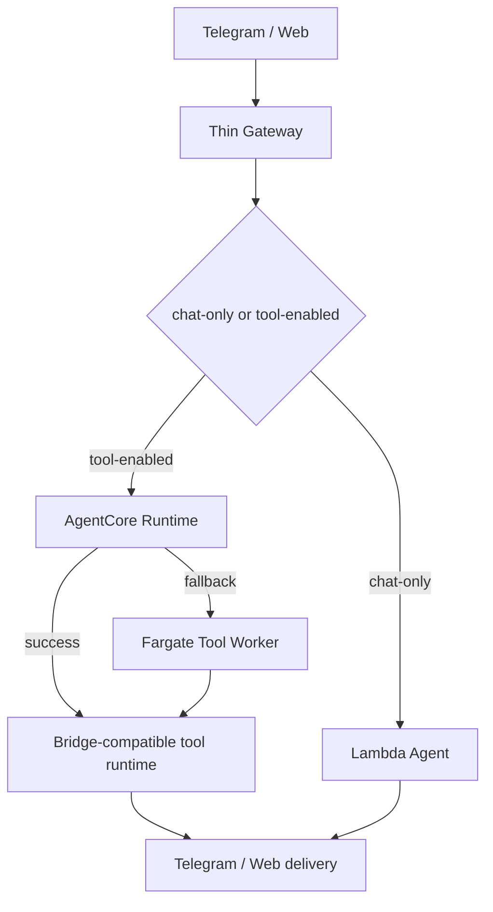

# Operational Copilot v1

Operational Copilot v1 is a read-only diagnostic workflow for Serverless OpenClaw. Its goal is to answer the first operations question quickly:

> Why did the last assistant turn not behave as expected?

The first version is intentionally small. It does not mutate DynamoDB state, stop ECS tasks, redrive queues, or change runtime provider flags. It only gathers evidence and explains the most likely failing layer.

## Scope

The v1 script inspects:

- Gateway Lambda logs
- AgentCore Runtime logs
- Fargate bridge logs
- Lambda agent logs
- `TaskState`
- active tool affinity in `Settings`
- pending messages in `PendingMessages`

It is designed for the current Deep Insight-inspired architecture:



## Usage

Diagnose the latest Telegram-linked user activity:

```powershell
powershell -File .\scripts\diagnose-operational-copilot.ps1 `
  -TelegramId 8585874705 `
  -SinceMinutes 30
```

By default, when a user or Telegram id is provided without an explicit trace id, the script focuses the output on the latest correlated trace. Use `-AllEvents` to inspect the full time window.

Diagnose a specific trace:

```powershell
powershell -File .\scripts\diagnose-operational-copilot.ps1 `
  -TraceId 68457971-d52b-43a3-8f34-bf344941ea16 `
  -SinceMinutes 30
```

Show raw matched events when the summary is not enough:

```powershell
powershell -File .\scripts\diagnose-operational-copilot.ps1 `
  -TelegramId 8585874705 `
  -SinceMinutes 30 `
  -IncludeRawEvents
```

Show the full operational timeline instead of the latest trace only:

```powershell
powershell -File .\scripts\diagnose-operational-copilot.ps1 `
  -TelegramId 8585874705 `
  -SinceMinutes 30 `
  -AllEvents
```

## Diagnosis model

The script maps log evidence to one of these layers:

| Layer | Meaning |
| --- | --- |
| `ingress` | No Gateway, Lambda, or runtime event was found in the selected window. |
| `agentcore` | Gateway invoked AgentCore, but no completion, fallback, or handoff was observed. |
| `tool-runtime` | AgentCore/Fargate accepted the message, but planner or delivery evidence is missing. |
| `chat-handoff` | Tool runtime handed the turn back to Lambda chat-only and delivery succeeded. |
| `lambda-agent` | Chat handoff occurred, but Lambda delivery did not complete. |
| `fallback` | AgentCore fallback was triggered, but downstream delivery is missing. |

## Current limitations

- The script is evidence-based, not an autonomous repair agent.
- CloudWatch log filtering is best-effort; narrow with `-TraceId` when possible.
- WebSocket and REST web paths are included by log group, but the first optimized path is Telegram.
- Unknown patterns should be promoted into the script after they occur in production.

## Next step

The next version should add guarded self-healing actions behind explicit flags:

- clear stale active tool affinity
- inspect and redrive pending messages
- reset fallback provider lock
- stop a stuck Fargate task
- run a targeted synthetic smoke after repair
